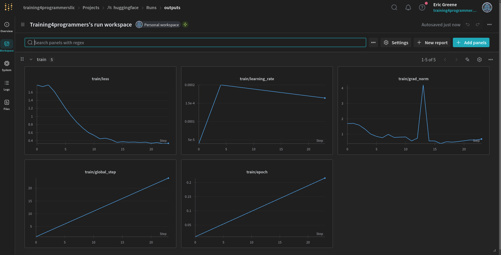

# Weights & Biases Charts

When you fine-tune a language model, you can track various training metrics to ensure that the model is learning effectively.

These charts come from Weights & Biases and show the evolution of various training metrics while fine-tuning your language model. Here is what each chart typically represents:

1. **train/loss**  
   - **What it is**: The training loss at each step or averaged over a few steps.  
   - **Why it matters**: It measures how well the model is fitting the training data. You generally want this to decrease over time. A smoothly declining loss indicates the model is learning. If it plateaus or rises, it might be overfitting or encountering training instability.

2. **train/learning_rate**  
   - **What it is**: The current learning rate used by the optimizer at each step.  
   - **Why it matters**: Modern training setups often use learning rate schedules (e.g., warmup, decay). Spikes or drops in this curve should match your training schedule. If it’s erratic when it shouldn’t be, or if it never decays, that might cause training problems.

3. **train/grad_norm**  
   - **What it is**: The norm (magnitude) of the gradients being applied to the model parameters at each step.  
   - **Why it matters**: Very large (exploding) or very small (vanishing) gradients can destabilize training. A big spike may suggest that a gradient clipping strategy could be needed. Steady, moderate grad norms are typically a good sign.

4. **train/global_step**  
   - **What it is**: The absolute count of training steps taken so far.  
   - **Why it matters**: This just increments with each update; it’s mainly a reference axis so you can see how other metrics change as training proceeds.

5. **train/epoch**  
   - **What it is**: How many full passes (epochs) over the dataset have been completed so far.  
   - **Why it matters**: Once you pass the size of the dataset, you start a new epoch. It’s another way of measuring training progress alongside the step count.

Putting it all together:

- **Loss** should generally trend downward.
- **Learning rate** often follows a predefined schedule (warmup then decay, for instance).
- **Gradient norm** spikes might indicate large updates; you may need clipping if those spikes are too large.
- **Global step** and **epoch** charts are primarily for tracking where you are in training and making sure your code and schedule are running as expected.